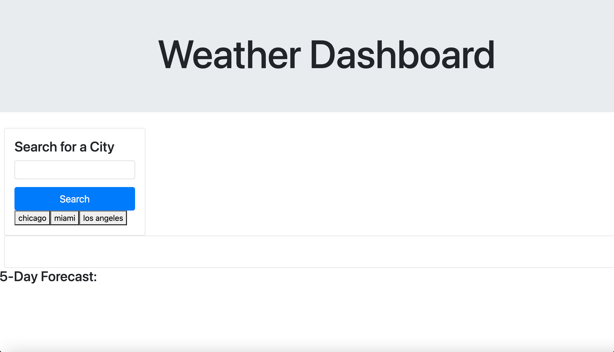
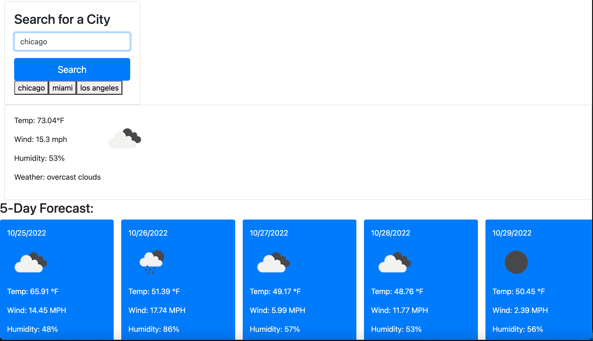

# Weather Dashboard

## Description

This assingment was designed to create a website that is used to allow a user to search for the weather in any city. The user should be allowed to see the current weather and the 5 day forecast. The application must store the user's inputs and allow the user to see their past inputs as a button. The button should then search again for the city's weather. This application can be very useful for user's to plan out their week based on the weather because it shows them the current weather as well as the five day forecast.

## Deployment Link

https://hamzaramzanali.github.io/challenge-6-weather/

## Screenshots

